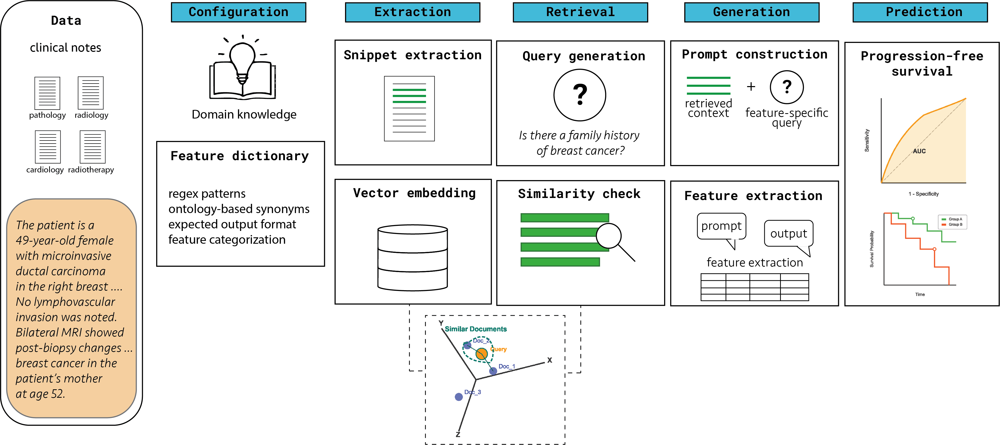

# OncoRAG

[](https://www.nature.com/articles/s41746-026-03170-8)
[](LICENSE)
[](pyproject.toml)

OncoRAG extracts structured clinical features from oncology notes using local
language models and patient-specific knowledge graphs.

Choose your variables, provide dated notes, and run the pipeline. With the supplied
local settings, notes stay local.

[](graphicalabstract.png)

*OncoRAG workflow and the paper's downstream progression-free-survival analysis.*

## Table Of Contents

1. [Quick Start](#quick-start)
2. [Synthetic Data And Evaluation](#synthetic-data-and-evaluation)
3. [Your Variables](#your-variables)
4. [Your Notes](#your-notes)
5. [Parameters And Outputs](#parameters-and-outputs)
6. [ChromaDB Or InterSystems IRIS](#chromadb-or-intersystems-iris)
7. [Patient Chat](#patient-chat)
8. [Citation](#citation)
9. [License](#license)

## Quick Start

Requirements: Python 3.10 or newer and a running local Ollama server.

Install OncoRAG and download the required models:

```bash
git clone --branch main --single-branch https://github.com/pgsalome/oncorag.git
cd oncorag
python -m venv .venv
source .venv/bin/activate
pip install -e .
pip install https://s3-us-west-2.amazonaws.com/ai2-s2-scispacy/releases/v0.5.4/en_ner_bc5cdr_md-0.5.4.tar.gz
ollama pull phi3:mini

oncorag --config configs/oncorag_synthetic_english.json --stage validate
oncorag --config configs/oncorag_synthetic_english.json
```

Check spaCy model compatibility with `python -m spacy validate`. The default NER
and embedding models are English-oriented.

To run a small example cohort with Python:

```bash
# English
python scripts/run_oncorag.py --config configs/oncorag_synthetic_english.json

# German
python scripts/run_oncorag.py --config configs/oncorag_synthetic_german.json

# English and German notes within each patient
python scripts/run_oncorag.py --config configs/oncorag_synthetic_mixed.json
```

## Synthetic Data And Evaluation

Two full synthetic cohorts are included:

| Dataset | Patients | Notes |
| --- | ---: | ---: |
| [oncorag-e (English)](examples/datasets/oncorag-e/registry.csv) | 489 | 2,930 |
| [oncorag-d (German)](examples/datasets/oncorag-d/registry.csv) | 489 | 2,930 |

To run a full cohort:

```bash
python scripts/run_oncorag.py --config configs/oncorag-e.json
python scripts/run_oncorag.py --config configs/oncorag-d.json
```

Each cohort has its own feature list. The small datasets in
`examples/datasets/demo` are used for Quick Start and testing. In the mixed version,
each patient has both English and German notes.

The paper evaluates separate clinical cohorts. See the
[dataset documentation](examples/datasets/README.md) and
[provenance report](examples/datasets/PROVENANCE.md) for generation and annotation details.

To run the tests:

```bash
pip install -e '.[dev,chat]'
python -m pytest tests -q
python scripts/run_synthetic_smoke.py --ollama-host http://127.0.0.1:11434
python scripts/run_chat_smoke.py --ollama-host http://127.0.0.1:11434
```

To evaluate the mixed-language test results:

```bash
python scripts/evaluate_synthetic.py \
  --config configs/oncorag_synthetic_mixed.json \
  --results outputs/synthetic_smoke/mixed/structured_features.json \
  --output outputs/synthetic_smoke/mixed/evaluation.json
```

The smoke tests use a local language model. To include the live IRIS integration
test, set `ONCORAGGRAPH_TEST_IRIS=1` and provide database credentials.

## Your Variables

Define variables in YAML or JSON. For example:

```yaml
features:
  - name: latest_hemoglobin
    type: numeric
    expected_range: [0, 30]
    unit: g/dL
    description: Hemoglobin in g/dL from the most recent dated report.
  - name: treatment
    type: categorical
    expected_range: [chemotherapy, radiotherapy]
    description: Cancer treatment documented as started.
```

Supported types: `integer`, `numeric`, `boolean`, `date`, `categorical`, `ordinal`
and `string`. Numeric bounds are inclusive; categorical values must match an
allowed label. Dates use `YYYY-MM-DD`, and missing values use JSON `null`.
Include units and temporal selection in the description.

Set `features.specifications` to your variable file and choose
`features.configuration_mode`:

- `automatic`: generates synonyms and adds ontology information with `create_config.py`.
- `manual`: uses your definitions and optional `synonyms`. The supplied examples use this mode.

Automatic mode requires `UMLS_API_KEY`, internet access and WordNet
(`python -m nltk.downloader wordnet omw-1.4`). `BIOPORTAL_API_KEY` is optional.
Ontology queries use feature definitions, so keep patient information out of them.

To generate feature configurations:

```bash
oncorag --config configs/oncorag_synthetic_english.json --stage config
python oncoraggraph/create_config.py --mode manual \
  --features-file examples/features.synthetic.yaml \
  --output-dir generated/custom --language english
```

The pipeline saves configurations to `features.generated_config_dir`; the standalone
command uses `--output-dir`. Review generated configurations before extraction.

## Your Notes

Use a folder or a registry. For folders, set `inputs.notes_root` and arrange notes as:

```text
notes/
  patient-001/
    oncology/2024-01-12.txt
    radiology/2024-02-03__report-02.txt
```

For multiple reports of the same type and date, use `YYYY-MM-DD__unique-note-id.txt`.
To use a registry instead, set `inputs.registry_path` to a CSV, JSONL or JSON file.
Example JSON registry:

```json
[
  {"patient_id":"patient-001","note_id":"report-02","report_type":"radiology","date":"2024-02-03","language":"de","path":"notes/report-02.txt"}
]
```

Set only one input option. Dates and report types come from folder names or registry
fields. Note paths are relative to the registry; configuration paths are relative
to the JSON configuration file. For a patient subset, set `inputs.patient_ids_file`
to a file containing one exact ID per line, including leading zeros.

## Parameters And Outputs

Copy an example configuration and update the input, feature and output paths.
See [the full configuration example](configs/oncorag_full_pipeline.example.json)
for all settings.

To choose an Ollama host and model for one run:

```bash
python scripts/run_oncorag.py --config configs/oncorag_synthetic_mixed.json \
  --ollama-host http://127.0.0.1:11435 --ollama-model phi3:mini
```

Settings are read in this order: command-line arguments, `OLLAMA_HOST` /
`OLLAMA_MODEL` environment variables, then JSON configuration.

| Setting | Controls |
| --- | --- |
| `runtime.ollama` | Model, temperature, context window, timeout, output limit and validation retries |
| `runtime.random_seed` | Generation seed |
| `retrieval` | Top-k, scoring weights, graph depth and graph-diffusion reranking |
| `graph` | NER models, context filters, deduplication and sentence nodes |
| `temporal_anchoring` | Temporal instructions for extraction |

Keep `runtime.workers` at 1. Set `graph.include_report_sentences: false` for
entity-only graphs.

Use `--stage validate` to check inputs, `--stage config` to generate configurations,
or `--stage graph` to build patient graphs. The default runs extraction.
Use `--force-rebuild` to rebuild cached graphs.

Results are saved under `outputs.root`: `structured_features.json`, patient graphs,
per-patient results, parameters, prompts and source evidence. Keep outputs
containing patient information private.

## ChromaDB Or InterSystems IRIS

ChromaDB is the default vector store. To use InterSystems IRIS:

```bash
pip install -e '.[iris]'
export IRIS_USERNAME=your_database_user
export IRIS_PASSWORD=your_database_password
```

Copy `vector_store` from [the IRIS example](configs/vector_store.iris.example.yaml)
into your pipeline configuration. Set `backend: iris` and your server details.
The default SapBERT embeddings have 768 dimensions. Keep credentials in environment
variables. Use `--vector-backend iris` to select IRIS for one run.

`runtime.local_processing_only: true` requires localhost or loopback IP addresses
for Ollama and IRIS. A remote server requires setting it to `false`.

## Patient Chat

To use the chatbot in a terminal:

```bash
oncorag-chat --config configs/oncorag_synthetic_mixed.json --list-patients
oncorag-chat --config configs/oncorag_synthetic_mixed.json \
  --patient-id SYN-DEMO-001 --loop
oncorag-chat --config configs/oncorag_synthetic_mixed.json \
  --patient-id SYN-DEMO-001 --question "What treatment actually started?" --json
```

Use `/clear` to clear the conversation and `/quit` to exit.
`python run_chatbot.py` accepts the same arguments.

To use the chatbot in a browser:

```bash
pip install -e '.[chat]'
python -m streamlit run streamlit_app.py --server.address 127.0.0.1 -- \
  --config configs/oncorag_synthetic_mixed.json
```

Open `http://127.0.0.1:8501` and select a patient. Review answers against the cited
notes. Keep the app on localhost; network deployment needs separate authentication.

## Citation

To cite OncoRAG:

```bibtex
@article{salome2026oncorag,
  title = {{OncoRAG}: graph-based retrieval enabling clinical phenotyping from oncology notes using local mid-size language models},
  author = {Salome, Patrick and Knoll, Maximilian and Walz, David and
            Cogno, Nicol{\`o} and Dedeoglu, Aylin S. and Qi, Aimee Letong and
            Isakoff, Steven J. and Abdollahi, Amir and Jimenez, Rachel B. and
            Bitterman, Danielle S. and Paganetti, Harald and Chamseddine, Ibrahim},
  journal = {npj Digital Medicine},
  year = {2026},
  doi = {10.1038/s41746-026-03170-8},
  url = {https://doi.org/10.1038/s41746-026-03170-8}
}
```

## License

[PolyForm Noncommercial License 1.0.0](LICENSE). Commercial use requires a separate
written agreement. Dataset and model licenses apply separately.

For research use.
